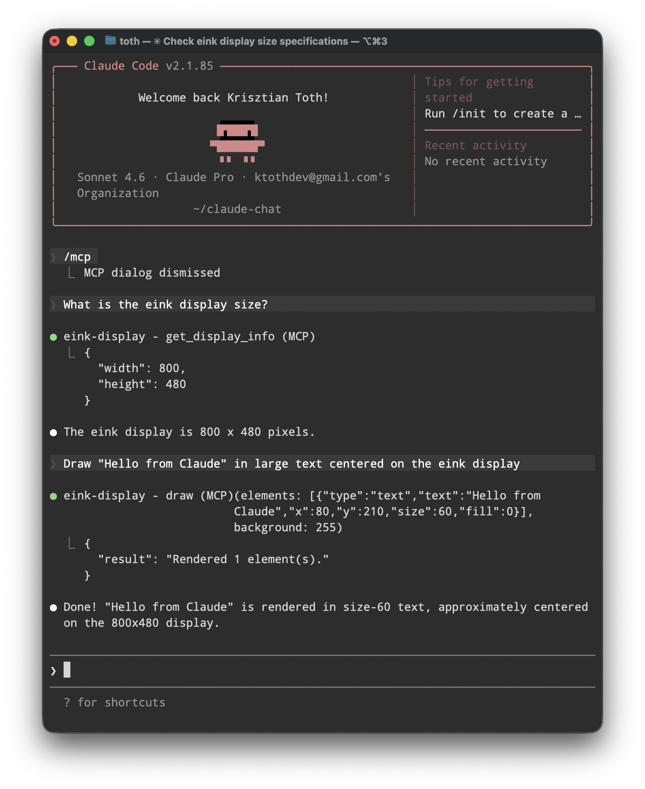
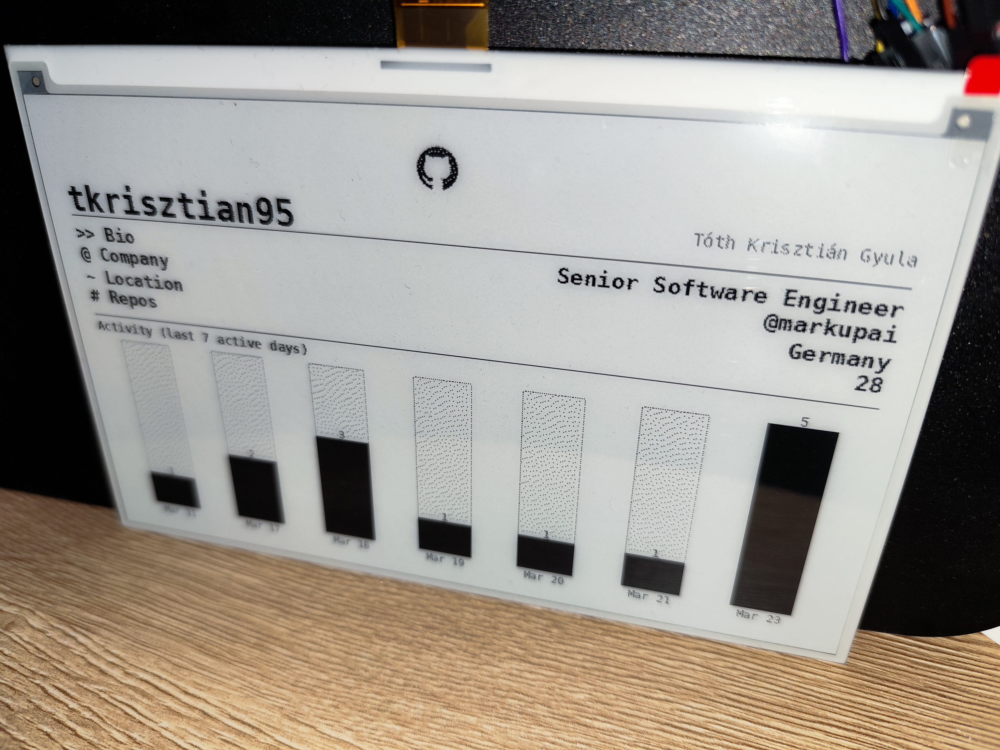

# eink-mcp

An MCP server that lets AI agents draw on or clear a Waveshare e-ink display.

## Screenshot



## Hardware

- Raspberry Pi (any model with GPIO)
- Any supported Waveshare e-Paper display (default: 7.5" V2, 800×480)

## Setup

**1. System packages**

```bash
sudo apt install python3-full python3-venv fonts-dejavu
```

**2. Virtual environment**

```bash
python3 -m venv venv
venv/bin/pip install -r requirements.txt
```

**3. Waveshare e-Paper library** (not on PyPI — clone it inside the project directory)

```bash
git clone https://github.com/waveshare/e-Paper
venv/bin/pip install ./e-Paper/RaspberryPi_JetsonNano/python/
```

After setup the directory should look like this:

```
eink-mcp/
├── server.py
├── display.py
├── requirements.txt
├── venv/          <- created by you, not in git
└── e-Paper/       <- cloned by you, not in git
```

## Running the server

```bash
venv/bin/python server.py
```

The server uses stdio transport (default for MCP).

### Claude Desktop

Add to `~/Library/Application Support/Claude/claude_desktop_config.json`:

```json
{
  "mcpServers": {
    "eink-display": {
      "command": "/path/to/eink-mcp/venv/bin/python",
      "args": ["/path/to/eink-mcp/server.py"],
      "env": {
        "EINK_DISPLAY_MODEL": "epd7in5_V2",
        "EINK_FONT_PATH": "/usr/share/fonts/truetype/dejavu/DejaVuSansMono.ttf",
        "EINK_FONT_PATH_BOLD": "/usr/share/fonts/truetype/dejavu/DejaVuSansMono-Bold.ttf"
      }
    }
  }
}
```

### Claude Code

**Install Claude Code on the Pi:**

```bash
curl -fsSL https://claude.ai/install.sh | sh
```

**Log in:**

```bash
claude login
```

**Register the MCP server:**

```bash
claude mcp add eink-display /path/to/eink-mcp/venv/bin/python -- /path/to/eink-mcp/server.py
```

**Verify the server is listed:**

```bash
claude mcp list
```

## Testing

Once added, ask Claude directly in the chat:

**Check the server is connected and get display dimensions:**
```
What is the eink display size?
```

**Draw something:**
```
Draw "Hello from Claude" in large text centered on the eink display
```

**Clear the display:**
```
Clear the eink display
```

Claude will pick up the `get_display_info`, `draw`, and `clear_display` tools automatically. On a Mac without Pi hardware, tool calls still succeed — a `WARNING Hardware not available` line appears in the server's stderr log instead of writing to the display.

## Configuration

| Environment variable | Default | Description |
|----------------------|---------|-------------|
| `EINK_DISPLAY_MODEL` | `epd7in5_V2` | Waveshare display model name — drives both hardware driver and canvas dimensions. Built-in models: `epd7in5_V2` (800×480), `epd7in5_V3` (800×480), `epd7in5` (640×384), `epd5in83_V2` (648×480), `epd4in2` / `epd4in2_V2` (400×300), `epd2in13_V4` (122×250), `epd2in7` (176×264), `epd1in54_V2` (200×200). Unknown values fall back to 800×480. |
| `EINK_FONT_PATH` | `/usr/share/fonts/truetype/dejavu/DejaVuSansMono.ttf` | Default font for text elements |
| `EINK_FONT_PATH_BOLD` | `/usr/share/fonts/truetype/dejavu/DejaVuSansMono-Bold.ttf` | Bold font for text elements |

## Development

Install dev dependencies:

```bash
venv/bin/pip install -r requirements-dev.txt
```

**Lint and format:**

```bash
ruff check .
ruff check --fix .
ruff format .
```

If the Waveshare hardware is unavailable (e.g. on a Mac), `draw` and `clear_display` log a dry-run message instead of crashing, so you can develop and test tool schemas without a Pi.

## Troubleshooting

**`No module named 'waveshare_epd'`**
```bash
venv/bin/pip install ./e-Paper/RaspberryPi_JetsonNano/python/
```

**`No module named 'spidev'` / `No module named 'lgpio'`**
```bash
venv/bin/pip install -r requirements.txt
```

**SPI not enabled**
```bash
sudo raspi-config nonint do_spi 0
sudo reboot
```

## Prompts

Ready-made prompts for common drawings. Copy the prompt, fill in any placeholders, and paste it into Claude.

| Prompt | Description | Preview |
|--------|-------------|---------|
| [GitHub Profile](prompts/github-profile-eink.md) | Renders a GitHub user's profile card with stats and 7-day activity chart |  |

## Tools

| Tool | Description |
|------|-------------|
| `get_display_info` | Returns display dimensions and named font sizes |
| `clear_display` | Clears the display to white |
| `render_layout` | Renders a structured dashboard — sections stack vertically, no coordinates needed |
| `draw` | Renders a list of raw drawing elements — full pixel-level control |

### render_layout — sections

Sections stack top-to-bottom automatically. Pass them in display order.

**header**
```json
{ "type": "header", "title": "My Dashboard", "subtitle": "10:15" }
```

**divider**
```json
{ "type": "divider", "light": false, "bold": false }
```
- `light` — grey rule; `bold` — thicker rule

**stat_block**
```json
{ "type": "stat_block", "label": "Today", "value": "1.2K tok", "progress": 0.45, "detail": "987 in / 247 out", "badge": "Resets 13h" }
```
- `progress` — 0.0–1.0; omit to hide the bar
- `badge` — small label to the right of the bar

**text_row**
```json
{ "type": "text_row", "left": "Status: OK", "right": "v1.2", "size": "small" }
```

**spacer**
```json
{ "type": "spacer", "height": 10 }
```

**bar_chart** *(must be last — fills remaining space)*
```json
{ "type": "bar_chart", "title": "7-day tokens", "data": [{"label": "Mon", "value": 48300}, {"label": "Tue", "value": 72100}] }
```

**image_block**
```json
{ "type": "image_block", "path": "/path/to/file.png", "width": 400 }
```

### draw — drawing elements

All elements are passed as a list to `draw`. Each must have a `type` field.

**text**
```json
{ "type": "text", "text": "Hello", "x": 10, "y": 10, "size": "label", "bold": false, "fill": 0, "align": "left", "max_width": null, "font": null }
```
- `size` — pixel integer or named size: `title`(34) `large`(28) `label`(19) `value`(17) `small`(14) `tiny`(12)
- `bold` — uses the bold variant of the default font
- `align` — `"left"` (default), `"center"`, or `"right"`; positions text within `[x, x+max_width]`
- `max_width` — alignment box width; defaults to full canvas width
- `font` — optional path to a custom `.ttf` file

**rect**
```json
{ "type": "rect", "x0": 10, "y0": 10, "x1": 200, "y1": 80, "outline": 0, "fill": null }
```

**line**
```json
{ "type": "line", "x0": 0, "y0": 0, "x1": 800, "y1": 480, "fill": 0, "width": 2 }
```

**ellipse**
```json
{ "type": "ellipse", "x0": 100, "y0": 100, "x1": 300, "y1": 300, "outline": 0, "fill": null }
```

**progress_bar**
```json
{ "type": "progress_bar", "x": 20, "y": 100, "width": 760, "height": 12, "value": 0.65, "fill": 0, "background": 240, "outline": 100 }
```
- `value` — fill fraction, `0.0`–`1.0`

**divider**
```json
{ "type": "divider", "y": 150, "fill": 0, "width": 1, "margin": 20 }
```
- Draws a full-width horizontal line with a left/right margin

**image**
```json
{ "type": "image", "path": "/path/to/file.png", "x": 0, "y": 0, "width": null, "height": null }
```
- `width`/`height` — scale the image; if only one is set, aspect ratio is preserved

Colour values: `0` = black, `255` = white, any integer 0–255 for greyscale.
